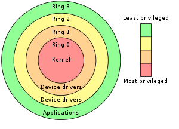
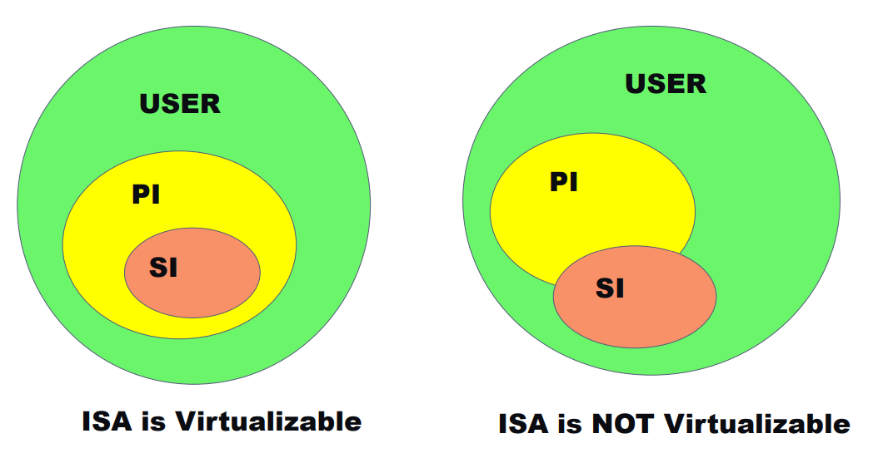
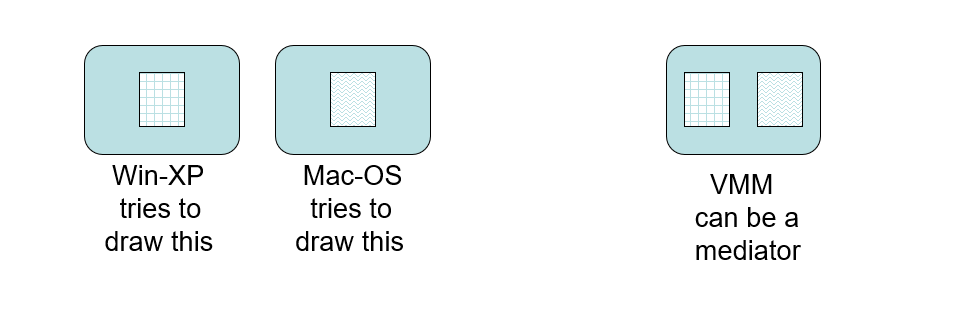
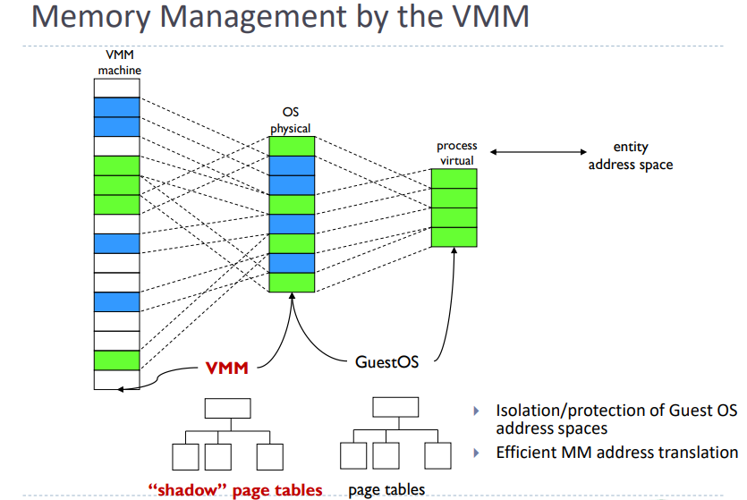

# Contents

1. [LEGO](#example)
    1. hello
3. [Virtualization](#Virtualization)
4. [ARM](#third-example)
5. [Virtualization](#Virtualization)
    1. 

# Virtualization

## Virtualization vs Emulation

Emulation is the ability to be able to emulate or reproduce the behavior of any instruction from any architecture on top of our system. For example, running any instruction from the ARM ISA on a system with x86 ISA would require special emulation software that can reproduce the behavior of every ARM instruction by either emulating the CPU or by using x86 instructions.

Virtualization is the process of assisting a Virtual Machine that runs on the same architecture by using our hardware's assistance instead of emulating every instruction.

## Privilege Levels

Privilege Levels or Rings exist to guard the information that would otherwise be sharable between procedures and kernel calls. For example, if a syscall used the same stack as a normal procedure, that would be a huge security issue as. 

To defend against that, kernel procedures that are sensitive run on a priviledged level called Ring 0. On the other hand, userland applications that are not trusted should be executed in Ring 3. Communication between Rings should only be done using Kernel traps, or syscalls.

Ring 0 - Kernel\
Ring 3 - Userland\
Ring 1 and 2 are usually unused.



Different Ring levels use completely different stacks - a transition between Rings is always accompanied by a "stack-switch" operation.

## Classic Virtualization Theorems

### Instruction Types

1. PI - Privileged Instructions: Execute in kernelmode, trap in usermode
2. PS - Privileged State: 
3. SI - Sensitive Instructions: Behavior depends on current Ring

### Theorem 1

A VMM may be constructed if the set of SI's is a subset of the set of PI's




The problem is that not all of X86's sensitive instructions are privileged instructions. This means that resource modification can occur without the VMM seeing and handling it which can be dangerous. Alternatively, it could mean executing an instruction within the guest operating system in user mode and seeing a different effect than having executed it in system mode. According to this paper there are seventeen instructions in x86 that are sensitive but are not privileged. One example is POPF when has different semantics depending on the machine's mode.

## Trap and Emulate

Operating systems are made with the idea of having all the hardware to themselves. Obviously, this can't work with Virtualization as we would like multiple OS to run at the same time without interfering with each other.

Thus, the hypervisor can detect wether an OS is trying to do something that would affect another OS and emulate that behavior instead of letting it run on the hardware. By doing that, the hypervisor can decide what the behavior of the instruction will be and protect the integrity of other OS's.

For example, OS A and OS B both try to draw on the screen using the GPU. Instead of letting them have full control of the screen, we can instead trap and emulate those calls to draw both, or one of the images on the screen:



## Binary Translation

## Hardware-Assisted Virtualization

## Para-Virtualization

## Hypervisor Types

1. Type I - Run directly on hardware\
    Type I hypervisors run bare-metal on hardware, just like a bootloader or an operating system would. Examples of Type I hypervisors are:\
    ```XEN, Hyper-V, IBM LPAR, ESXi```
2. Type II - Run on host OS\
    Type II hypervisors run on a pre-existing operating system, just like actual software they are userspace processes. Examples of Type II hypervisors are:\
    ```VMWare, VirtualBox, KVM, QEMU```

## Key Techniques

1. De-Privileging\
    Hypervisors emulate the effect on hardware resources requested by privileged guest instructions (Trap and Emulate). Usually achieved by running the guest at a lower hardware priority level than the hypervisor. ```Execute normal instructions, trap privileged ones. ```
2. Shadow Structures\
    The hypervisor keeps a safe copy of critical structures () that the guest will modify. This is both for security and to ensure each guest gets a correct environment. For example, for the page tables:
    

3.